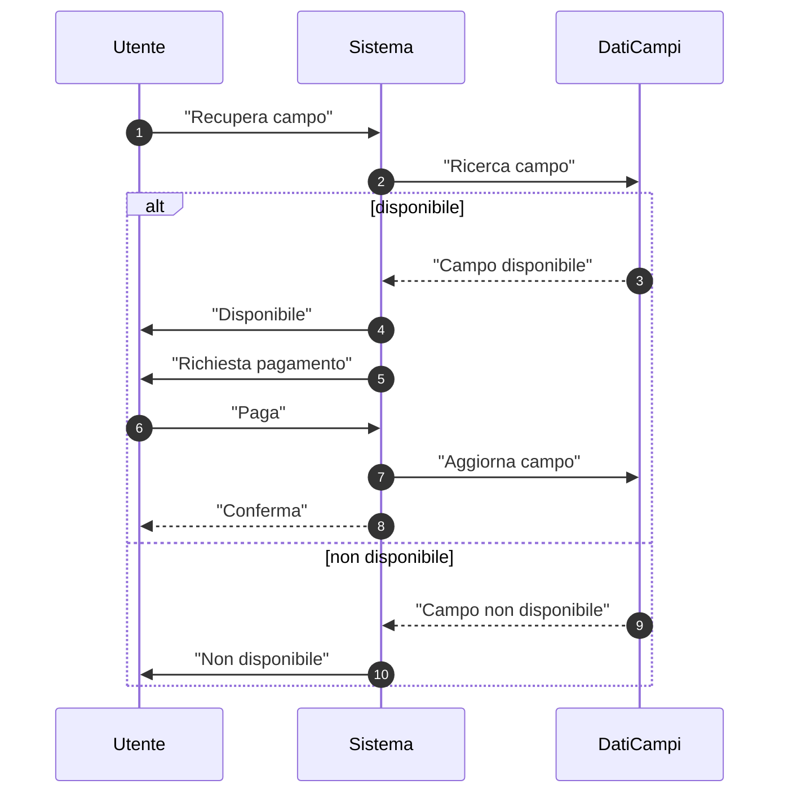

# Event trace

```mermaid
sequenceDiagram
autonumber
Utente ->> Sistema: "Recupera campo"
Sistema ->> DatiCampi: "Ricerca campo"
alt disponibile
DatiCampi -->> Sistema: "Campo disponibile"
Sistema ->> Utente: "Disponibile"
Sistema ->> Utente: "Richiesta pagamento"
Utente ->> Sistema: "Paga"
Sistema ->> DatiCampi: "Aggiorna campo"
Sistema -->> Utente: "Conferma"
else non disponibile
DatiCampi -->> Sistema: "Campo non disponibile"
Sistema ->> Utente: "Non disponibile"
end
```

